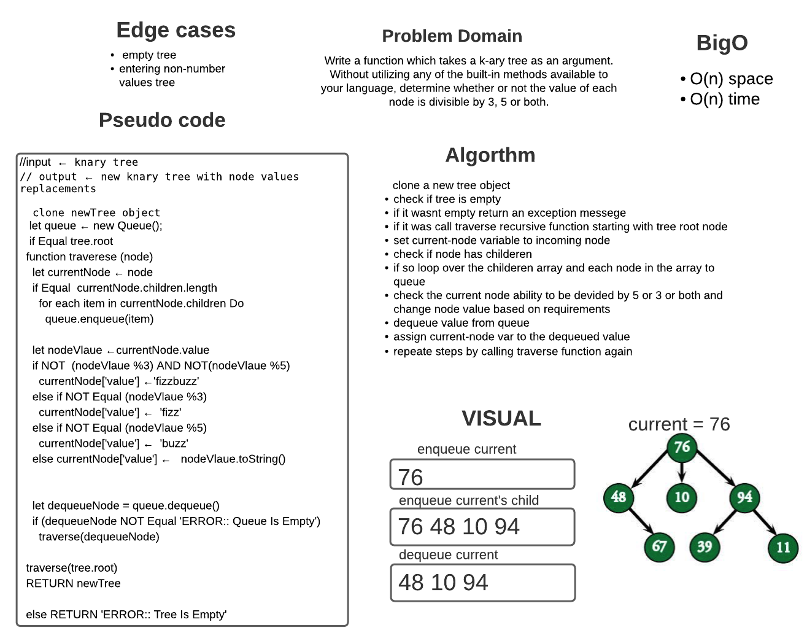

# Knary-tree

The K-ary tree is a rooted tree, where each node can hold at most k number of children.

If the value of k is 2, then this is known as binary tree. The binary tree, or ternary trees are some specialized k-ary trees. So k-ary trees re generalized.

## Challenge

Write a function which takes a k-ary tree as an argument. Without utilizing any of the built-in methods available to your language, determine whether or not the value of each node is divisible by 3, 5 or both.

 
 

## Approach & Efficiency

 

### **Approach** : I used recursion in all methods to traverse through tree nodes :

- clone a new tree object  
- check if tree is empty 
- if it wasnt empty return an exception messege 
- if it was call traverse recursive function starting with tree root node 
- set current-node variable to incoming node
- check if node has childeren
- if so loop over the childeren array and each node in the array to queue
- check the current node ability to be devided by 5 or 3 or both and change node - value based on requirements 
- dequeue value from queue 
- assign current-node var to the dequeued value 
- repeate steps by calling traverse function again   

 

### **Efficiency** : recursion  increased the Big O for the methods . cause with each time the function called in recursion it takes up a space in the call stack . and takes time to re-invoke the function . 

### If tree was balanced the Big O would be log n on average . 

 
 

## API

**fizzBuzzTree**: which takes a k-ary tree as an argument.
Without utilizing any of the built-in methods available to your language, determine whether or not the value of each node is divisible by 3, 5 or both.

## Whiteboard 
 
 

