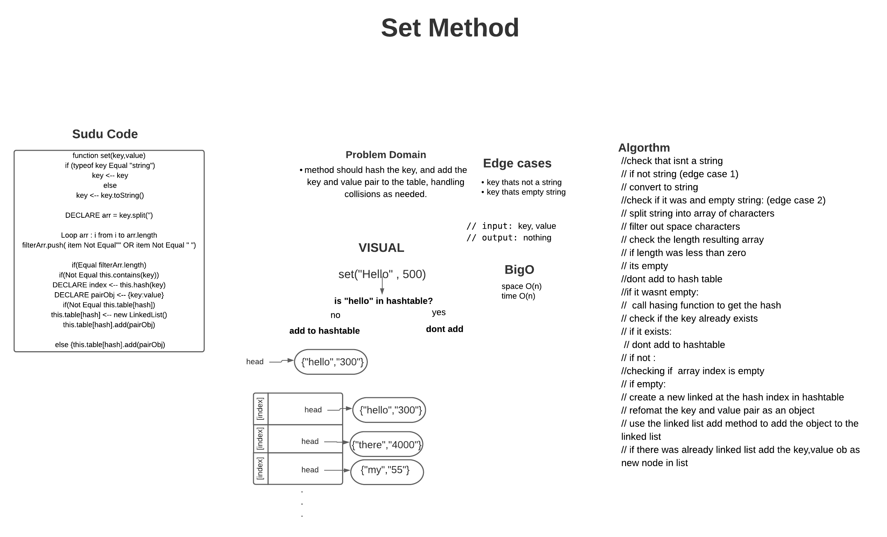
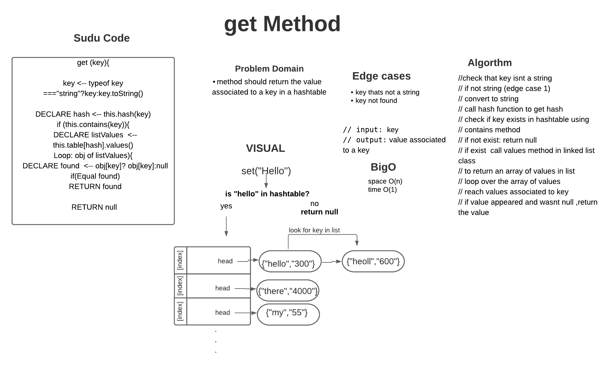
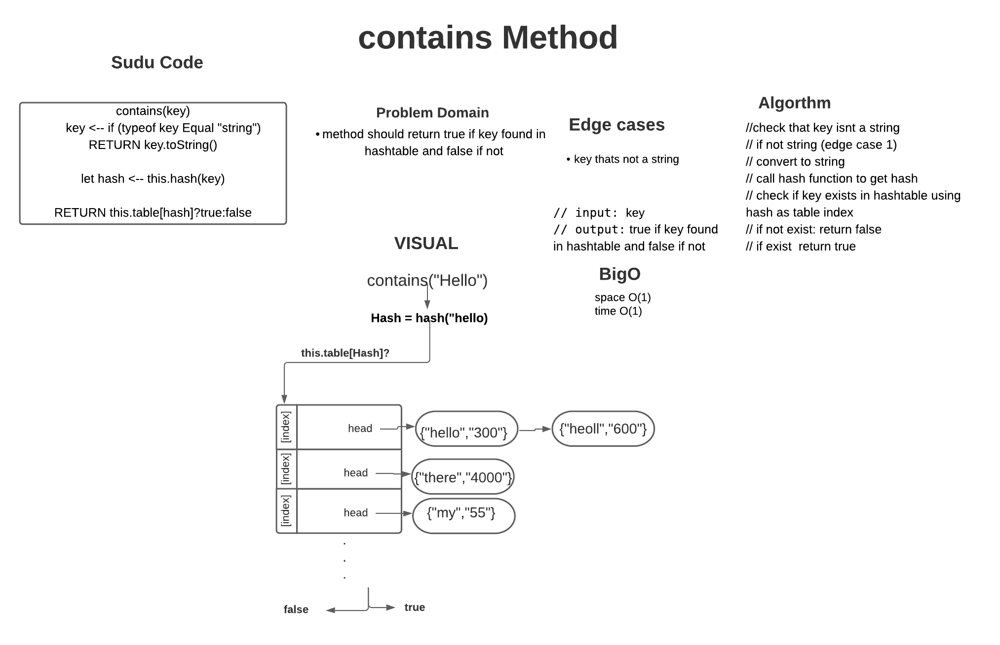
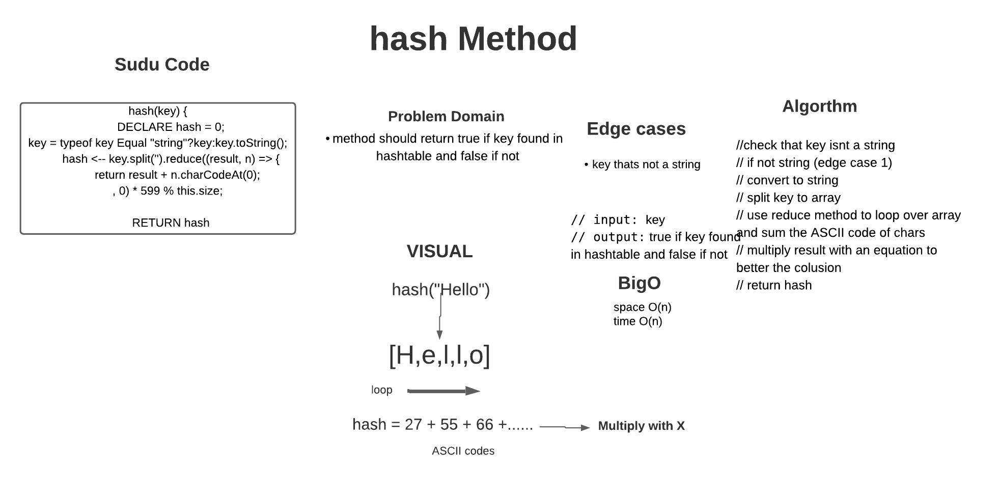

# Hash-Table 

### The Hashtable class implements a hash table, which maps keys to values. Any non-null object can be used as a key or as a value. To successfully store and retrieve objects from a hashtable, the objects used as keys must implement the hashCode method and the equals method.  

<br><br>


### Features of Hashtable

<br>

- It is similar to HashMap, but is synchronized.
- Hashtable stores key/value pair in hash table.
- In Hashtable we specify an object that is used as a key, and the value we want to associate to that key. The key is then hashed, and the resulting hash code is used as the index at which the value is stored within the table.
- The initial default capacity of - Hashtable class is 11 whereas loadFactor is 0.75.


# Challenge Summary

creating hashtable class that has 4 neccessary methods : 

- add
Arguments: key, value
Returns: nothing
This method should hash the key, and add the key and value pair to the table, handling collisions as needed.


- get
Arguments: key
Returns: Value associated with that key in the table

- contains
Arguments: key
Returns: Boolean, indicating if the key exists in the table already.

- hash
Arguments: key
Returns: Index in the collection for that key
## Whiteboard

1. set()



2. get()



3. contains()



4. hash()




## Solution

```js
// 1] require HashTable class
// 2] create new Hashtable
  //3] pass proper array size
  let myhash = new HashTable(1024)

    //3] call methods and console results
    console.log(myhash.set("Ben",500));
    console.log(myhash.get("Ben"));
    console.log(myhash.contains("Ben"));
    console.log(myhash.hash("Ben"));

  
```