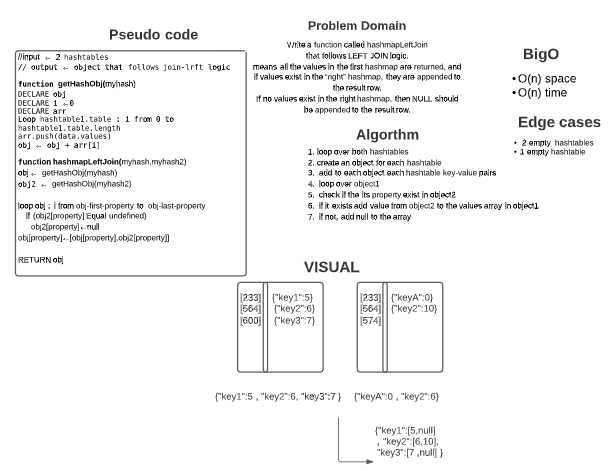

# Challenge Summary

Write a function called hashmapLeftJoin
that follows LEFT JOIN logic.
means all the values in the first hashmap are returned, and if values exist in the “right” hashmap, they are appended to the result row.
If no values exist in the right hashmap, then NULL should be appended to the result row.
## Whiteboard Process




## Approach & Efficiency
1. loop over both hashtables
2. create an object for each hashtable
3.  add to each object each hashtable key-value pairs
4.  loop over object1 
5.  check if the its property exist in object2
6.  if it exists add value from object2 to the values array in object1
7.  if not, add null to the array

What is the Big O space/time for 
- time :  O(n)
- space : O(n)

## Solution

```js
// 1] require HashTable class
// 2] create 2 HashTables

  let myhash = new HashTable(1024);
  myhash.set('John', 'Boss');
  myhash.set('Cathy', 'Boss');
  myhash.set('Rosie', 'TA');
  myhash.set('Cat', 'TA');
  myhash.set('Justin', 'Student');
  myhash.set('Jason', 'Teacher');
  myhash.set('Ben', 'Student');

  let myhash2 = new HashTable(1024);
  myhash2.set('John', 'Dad');
  myhash2.set('Cathy', 'Mom');
  myhash2.set('Rosie', 'Daughter');
  myhash2.set('Cat', 'Son');
  myhash2.set('Justin', 'Mom');
  myhash2.set('Sarah', 'Teacher');

    //3] call function and console result
    console.log( hashmapLeftJoin(myhash,myhash2));

    //4] examples results :
{
  Ben: [ 'Student', null ],
  John: [ 'Boss', 'Dad' ],
  Cathy: [ 'Boss', 'Mom' ],
  Jason: [ 'Teacher', null ],
  Justin: [ 'Student', 'Mom' ],
  Rosie: [ 'TA', 'Daughter' ],
  Cat: [ 'TA', 'Son' ]
}


```

