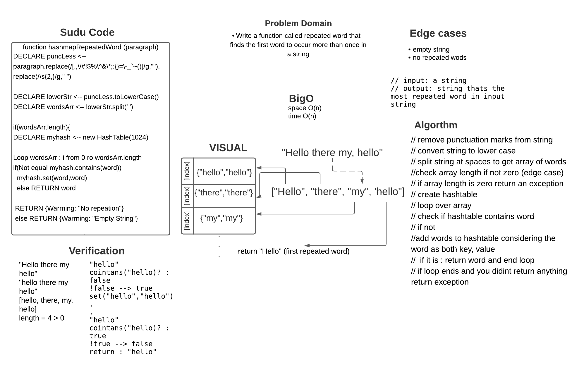

# Challenge Summary

Write a function called repeated word that finds the first word to occur more than once in a string

## Whiteboard Process




## Approach & Efficiency
1. remove punctuation marks from string
2. convert string to lower case 
3. split string at spaces to get array of words
3. check array length if not zero (edge case) 
4. if array length is zero return an exception 
5. create hashtable 
6. loop over array 
7. check if hashtable contains word 
8.  if not ]add words to hashtable considering the word as both key, value 
9.  if it is : return word and end loop 
10.  if loop ends and you didit return anything : return exception    

What is the Big O space/time for 
- time :  O(n)
- space : O(n)

## Solution

```js
// 1] require HashTable class to use contains() and set() methods
// 2] pass string of words
  let paragraph2 = 'Once upon a time, there was a brave princess who...'	;

    //3] call function and console result
    console.log(hashmapRepeatedWord(paragraph2));
    //4] examples results :
'a'
```