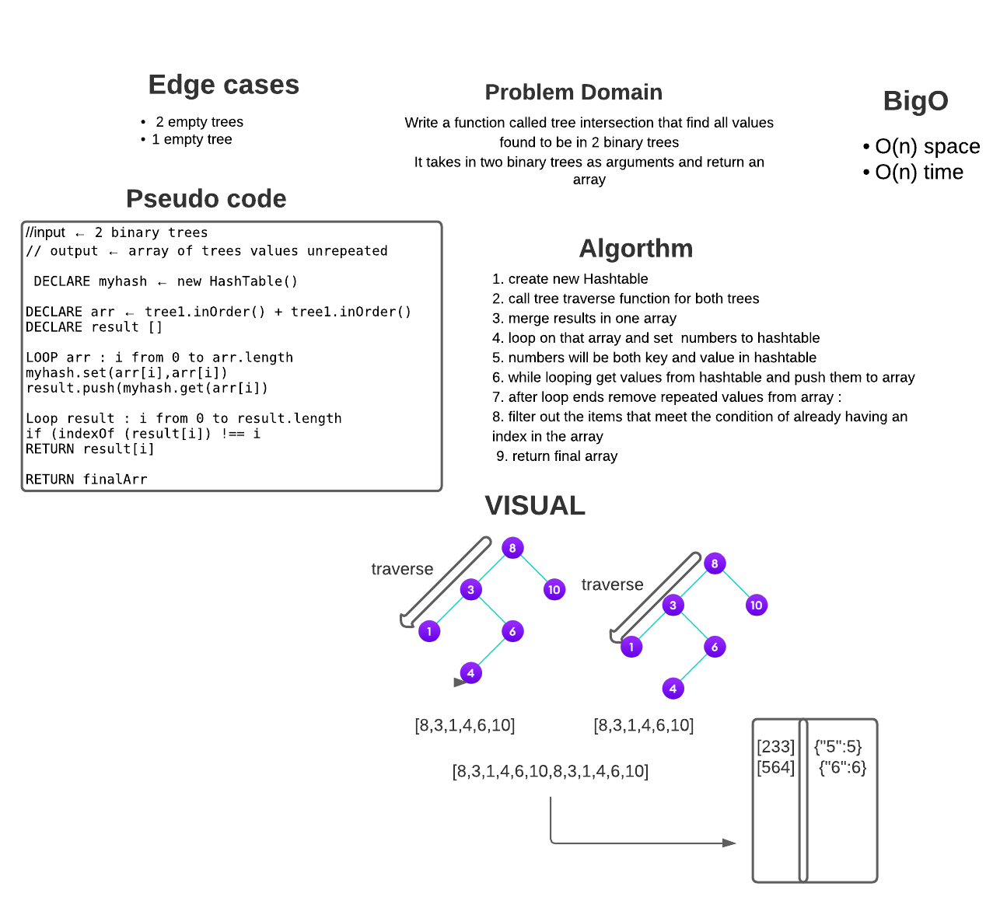

# Challenge Summary

Write a function called tree intersection that find all values found to be in 2 binary trees
It takes in two binary trees as arguments and return an array

## Whiteboard Process




## Approach & Efficiency
1. create new Hashtable 
2. call tree traverse function for both trees 
3. merge results in one array
4. loop on that array and set  numbers to hashtable
5. numbers will be both key and value in hashtable
6. while looping get values from hashtable and push them to array
7. after loop ends remove repeated values from array :
8. filter out the items that meet the condition of already having an index in the array 
9. return final array

What is the Big O space/time for 
- time :  O(n)
- space : O(n)

## Solution

```js
// 1] require Node class
// 2] create 2 trees
let one = new Node(1);
    let two = new Node(2);
    let three = new Node(3);
    let four = new Node(4);
    let five = new Node(5);
    let six = new Node(6);
    let seven = new Node(7);
    let eight = new Node(8);
    let nine = new Node(9);

    one.left = two;
    one.right = three;
    two.left = six;//
    six.right = seven;
    seven.left = eight;
    seven.right = nine;
    three.left = four;
    three.right = five;

    //             1
    //     2               3
    // 6        -      4       5
    //     7
    // 8       9
    let tree1 = new BinaryTree(one);
    let tree2 = new BinaryTree(two);

    //3] call function and console result
    console.log(hashmapTreeIntersection(tree3,tree1));

    //4] examples results :
[
  6, 8, 7, 9, 2,
  1, 4, 3, 5
]


```

