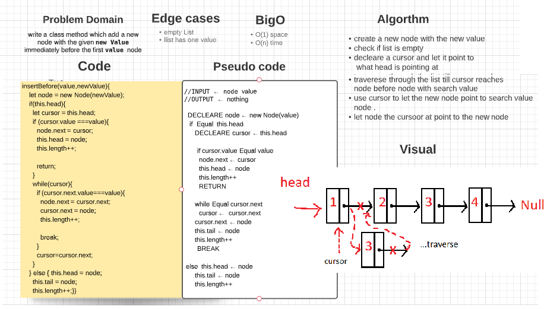

# CODE CHALLENGE (5)

## `insert()`

  

  

## `include()`

  

  

## `toString()`

  

# CODE CHALLENGE (6)

## `append()`

  

 

## `insertAfter()`

 

 

## `insertBefore()`

 

 

# CODE CHALLENGE (7)

## `kthFromEnd()`

 

  

