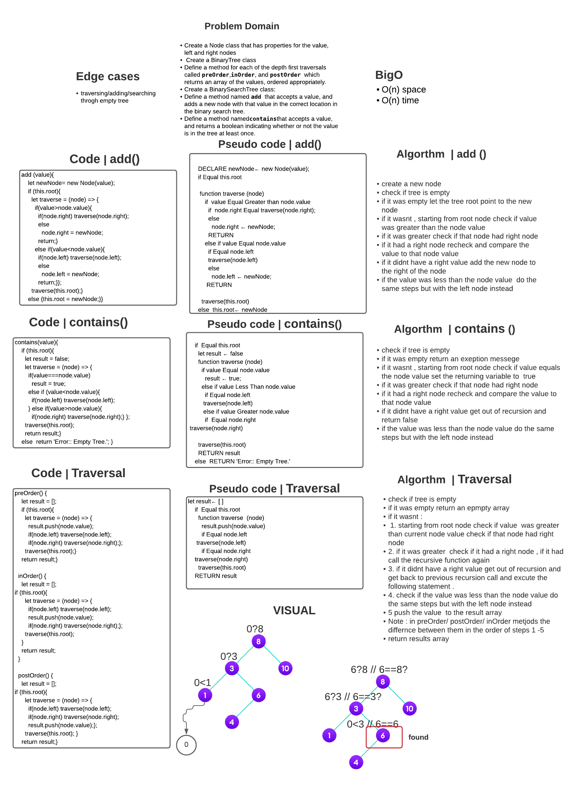
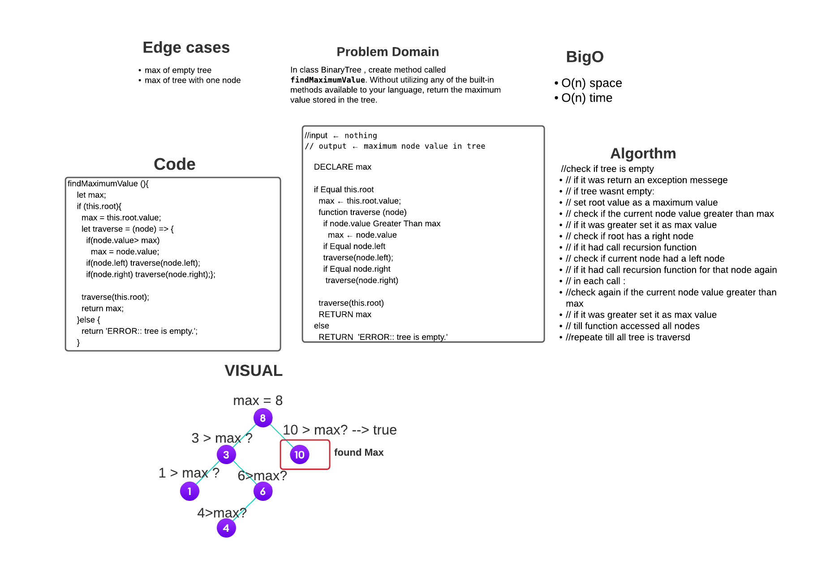

# Binary Search Tree (BST)

### Binary tree is a tree data structure in which each node has at most two children, which are referred to as the left child and the right child

 

### A binary tree is made of nodes, where each node contains a "left" pointer, a "right" pointer, and a data element. ... The left and right pointers recursively point to smaller "subtrees" on either side. A null pointer represents a binary tree with no elements

  

### binary trees have 3 ways to traverse them based on tree depth .

Depth First Traversals: 

 - Inorder (Left, Root, Right) 
 - Preorder (Root, Left, Right) 
-  Postorder (Left, Right, Root)

  

### Binary search tree (BST), allow binary search for fast lookup, addition and removal of data items . 

### Its a  tree whose internal nodes each store a key greater than all the keys in the node's left subtree and less than those in its right subtree. 

### A binary tree is a type of data structure for storing data such as numbers in an organized way. 

  

## Challenge

- Create a Node class that has properties for the value stored in the node, the left child node, and the right child node.

- Create a BinaryTree class
Define a method for each of the depth first traversals called preOrder, inOrder, and postOrder which returns an array of the values, ordered appropriately.

- Create a BinarySearchTree class
Define a method named add that accepts a value, and adds a new node with that value in the correct location in the binary search tree.

- Define a method named contains that accepts a value, and returns a boolean indicating whether or not the value is in the tree at least once.

- **Code Challenge 16** 
- Write an instance method called find-maximum-value. Without utilizing any of the built-in methods available to your language, return the maximum value stored in the tree.

 
 

## Approach & Efficiency

 

### **Approach** : I used recursion in all methods to traverse through tree nodes :

1. For contains method loop throgh all nodes in the tree and on each iteration check the node value and return true if match.
2. After the loop return false
3. For add method create a new node with the value  check if the root was null then make it the new node .
4. Create a function accept a node and the new Node that do the following 
5. if the value of the new node less than the the node vaue then make the left of the node equal the functino called recursivly with the node equal the left of the previous node
6. Else do the same but with the right node
7. after  that return the node  

 

- **Code Challenge 16** 
- used recursion to traverse each node in tree cause its not BST, values arent ordered, I traversed each nod and checked its left and right nodes and checked if its value was greater than the max and asigned it to max variable if that was true . 

### **Efficiency** : recursion  increased the Big O for the methods . cause with each time the function called in recursion it takes up a space in the call stack . and takes time to re-invoke the function . 

### If tree was balanced the Big O would be log n on average . 

 
 

## API

**preOrder**: Return an array with depth first traversals using the pre order concept

**inOrder**: Return an array with depth first traversals using the inOrder concept

**postOrder**: Return an array with depth first traversals using the postOrder concept

**add**: Accepts a value, and adds a new node with that value in the correct location in the binary search tree.

**contains**: Accepts a value, and returns a boolean indicating whether or not the value is in the tree at least once.

**findMaximumValue()** : accepts no values and return the maximum value stored in the tree.

## Whiteboard 
 
 

## Code Challenge 15

## Code Challenge 16

